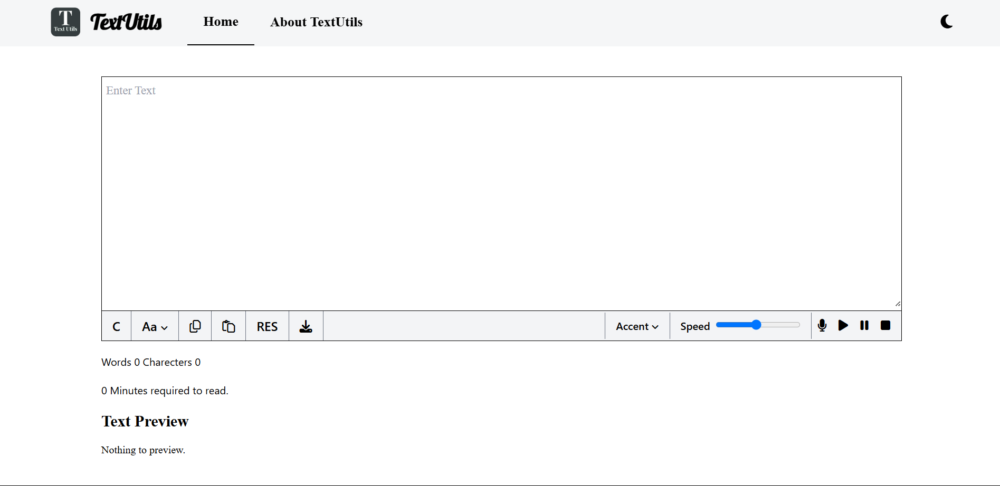
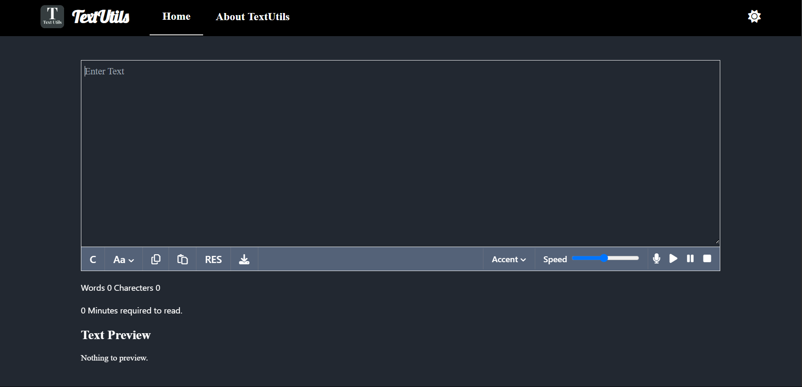

[⚠️ Suspicious Content] # 📝 TextUtils

TextUtils is a simple and user-friendly web app that provides quick and efficient text manipulation tools. Whether you need to convert cases, clean up extra spaces, or count characters and words, TextUtils makes it fast and easy — right in your browser.

🔗 **Live Demo**: [TextUtils](https://text-utils-478e29asd-sachin-paithanes-projects.vercel.app/)

---

## ✨ Features

- 🔠 Convert text to **UPPERCASE**
- 🔡 Convert text to **lowercase**
- ❌ Remove **extra spaces**
- 📋 **Copy** cleaned or converted text
- 📊 **Count** characters and words
- 🌗 Toggle between **light and dark** modes

---

## 🛠️ Tech Stack

- **React.js** – Frontend framework
- **Tailwind CSS** – Utility-first styling

---

## 🧩 Skills Used

- React functional components & hooks (`useState`)
- JSX templating
- Conditional rendering
- Tailwind CSS for responsive UI
- Event handling in React
- String manipulation in JavaScript
- Dark mode implementation
- Hosting & deployment with Vercel

---

## 📸 Screenshot
### 🏠 Home Page (Light Mode)


### 🏠 Home Page (Dark Mode)



---

## 🚀 Getting Started

To run this project locally:

```bash
git clone https://github.com/spaithane9172/text-utils.git
cd text-utils
npm install
npm start
